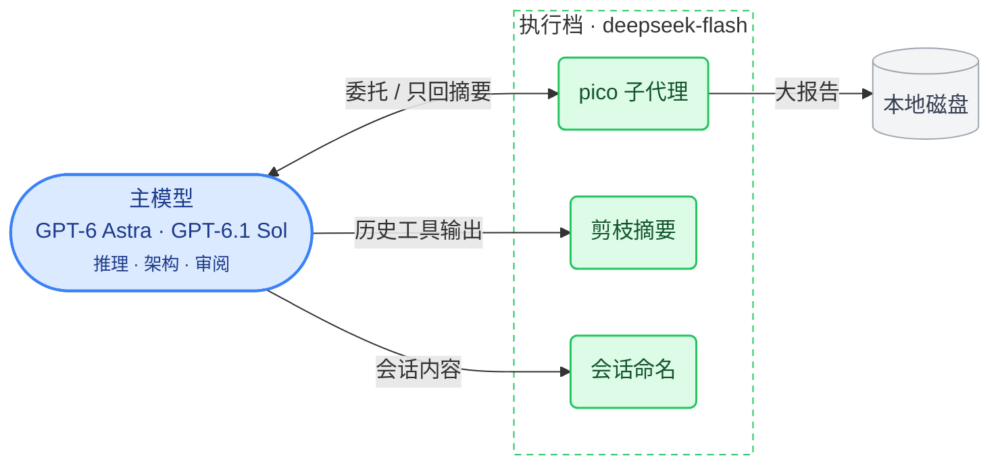

# pi-playbook

一套 [pi](https://github.com/earendil-works/pi)（@earendil-works/pi-coding-agent）的**配置参考手册**：每类配置解决什么问题，每个插件为什么装，每个参数管什么。配置来自作者本机，讲解写给所有想弄懂 pi 的人。

整套配置可以浓缩成一句话：

> **贵的模型做决策，便宜的模型做执行；上下文能剪就剪，能写盘就写盘。**



主力模型是 GPT-6 Astra / GPT-6.1 Sol，杂活交给廉价档；8 个供应商、12 个模型按场景切换。

## 从哪里开始

- **刚接触 pi**：从 [01 理念与路线](docs/01-理念与路线.md) 顺着读，每页底部都有翻页链接。
- **只想挑几个插件**：看下面的[插件总览](#插件总览)，点名字直接跳到对应小节，每个插件开头有一张速览卡。
- **想直接抄配置**：[`config/`](config/) 是本机配置的脱敏副本，各篇的“我的配置”逐项解释了为什么这样设。
- **调配置时查参数**：各插件小节末尾有参数表；pi 本体的设置查[参考](#参考)。

## 插件总览

| 插件 | 一句话 | 阶段 |
|------|--------|------|
| [pi-web-access](docs/02-基础阶段.md#pi-web-access--联网能力) | 联网搜索、网页/PDF/视频抓取、带引用的查证 | 基础 |
| [pi-autoname](docs/02-基础阶段.md#pi-autoname--会话命名) | 自动给会话起名，话题变了再更新 | 基础 |
| [pi-fff](docs/03-进阶阶段.md#ff-labspi-fff--搜索增强) | 用 Rust 引擎替换内置 find/grep，按常用度排序 | 进阶 |
| [pi-context-view](docs/03-进阶阶段.md#pi-context-view--上下文观察) | 看清上下文被什么占掉、注入了哪些隐藏内容 | 进阶 |
| [pi-cache-graph](docs/03-进阶阶段.md#pi-cache-graph--缓存观测) | 提示缓存命中率曲线与逐条明细 | 进阶 |
| [rpiv-ask-user-question](docs/03-进阶阶段.md#juicesharprpiv-ask-user-question--结构化提问) | 需求不明时弹问卷让你点选，而不是让模型猜 | 进阶 |
| [pi-subagents](docs/04-高阶阶段.md#tintinwebpi-subagents--子代理系统) | 把任务派给独立的子代理会话，可后台、并行 | 高阶 |
| [pi-condense](docs/04-高阶阶段.md#pi-condense--上下文剪枝) | 把用过的工具输出压成摘要，原文归档可取回 | 高阶 |
| [pi-claude-code-ui](docs/05-界面与观测.md#pi-claude-code-ui--工具渲染美化) | Claude Code 风格的工具调用渲染 | 界面 |
| [pi-claude-code-tui](docs/05-界面与观测.md#pi-claude-code-tui--启动页头与输入框本地定制) | Claude Code 风格的启动页头与输入框（本地定制） | 界面 |
| [pi-token-speed](docs/05-界面与观测.md#pi-token-speed--速度仪表) | 状态栏实时显示 TPS、首 token 延迟 | 界面 |

四个阶段的划分依据是解决哪类缺口、对 pi 改动有多深，详见 [01 理念与路线](docs/01-理念与路线.md#阶段的划分逻辑)。

## 文档导航

### 主线

按顺序读，每页底部可以翻到下一篇。

| 文档 | 内容 |
|------|------|
| [01 理念与路线](docs/01-理念与路线.md) | 三个缺口、三条理念、阶段划分、整体架构 |
| [02 基础阶段](docs/02-基础阶段.md) | 装 pi、配模型；联网、会话命名 |
| [03 进阶阶段](docs/03-进阶阶段.md) | 搜索增强、上下文观察、缓存监控、结构化提问 |
| [04 高阶阶段](docs/04-高阶阶段.md) | 子代理、上下文剪枝 |
| [05 界面与观测](docs/05-界面与观测.md) | 工具渲染、启动页头、配色主题、速度仪表、快捷键 |
| [06 pico 子代理](docs/06-pico子代理.md) | 自己写的执行代理：frontmatter 与 prompt 设计 |
| [07 全局指令](docs/07-全局指令.md) | AGENTS.md：委托规则、搜索纪律、云盘排除 |

### 参考

pi 本体配置的逐项注释，用到时查。

| 文档 | 内容 |
|------|------|
| [settings.json](docs/ref-settings.md) | 思考档位、模型清单、主题、插件列表等通用设置 |
| [models.json](docs/ref-models.md) | 自定义供应商与模型接入、思考档位映射 |

## 套用这份配置

`settings.json` 当前选用自定义主题 `dark-classic`。套用这份配置前，先在仓库根目录安装主题：

```bash
mkdir -p ~/.pi/agent/themes
cp config/themes/dark-classic.json ~/.pi/agent/themes/
```

主题文件见 [`config/themes/dark-classic.json`](config/themes/dark-classic.json)，本地定制启动页头的安装步骤见 [`plugins/pi-claude-code-tui/INSTALL.md`](plugins/pi-claude-code-tui/INSTALL.md)。

`~/.agents/skills/` 下的外部技能在本机单独管理，本仓库只收录 `settings.json` 里的技能发现设置。`auth.json`、模型缓存、会话记录等运行数据都留在本机。

<details>
<summary><b>几点约定</b></summary>

- `config/` 是本机配置的脱敏副本，文档里的“我的配置”与对应文件保持一致。
- 内容按本机 pi **1.1.0** 及已安装插件核对。
- 家目录统一写成 `~`；需要凭证的地方用环境变量名占位，按自己的环境设置。`settings.json` 的设备标识 `deviceId` 不入库，其余收录的配置与本机一致。
- 各插件小节的商店链接旁标注本机已装的版本号；`settings.json` 的 `packages` 保持本机的无版本写法。
- 参数表分“常用参数”和折叠起来的“其余参数”，没写到的参数取插件默认值。

</details>

<details>
<summary><b>目录结构</b></summary>

```
pi-playbook/
├── README.md                    # 你在这里
├── AGENTS.md / CLAUDE.md        # 维护规范（给人和 AI 看）
├── scripts/                     # 维护脚本：链接检查、Mermaid 预览
├── docs/                        # 讲解文档，见上方导航
├── plugins/
│   └── pi-claude-code-tui/      # 本地定制插件（完整源码 + 定制说明）
├── config/                      # 本机配置的脱敏副本
│   ├── settings.json            #   ~/.pi/agent/settings.json
│   ├── keybindings.json         #   ~/.pi/agent/keybindings.json（见 05）
│   ├── models.json              #   自定义供应商与模型接入（zenmux / akile 网关 + kimi-coding 模型覆盖，见 ref-models）
│   ├── web-search.json          #   ~/.pi/agent/web-search.json
│   ├── pi-autoname.json         #   ~/.pi/agent/pi-autoname.json
│   ├── pi-fff.json              #   ~/.pi/agent/pi-fff.json（见 03）
│   ├── pi-claude-code-tui.json  #   ~/.pi/agent/pi-claude-code-tui.json（界面选择状态，见 05）
│   ├── agents/pico.md           #   ~/.pi/agent/agents/pico.md
│   ├── themes/dark-classic.json #   ~/.pi/agent/themes/dark-classic.json（自定义主题）
│   └── AGENTS.md                #   ~/.pi/agent/AGENTS.md
├── LICENSE
└── .gitignore

</details>

## 致谢

11 个插件中，10 个来自社区开发者，仓库地址列在各阶段文档每节开头；pi-claude-code-tui 是本地定制版，源码在 `plugins/` 目录。
