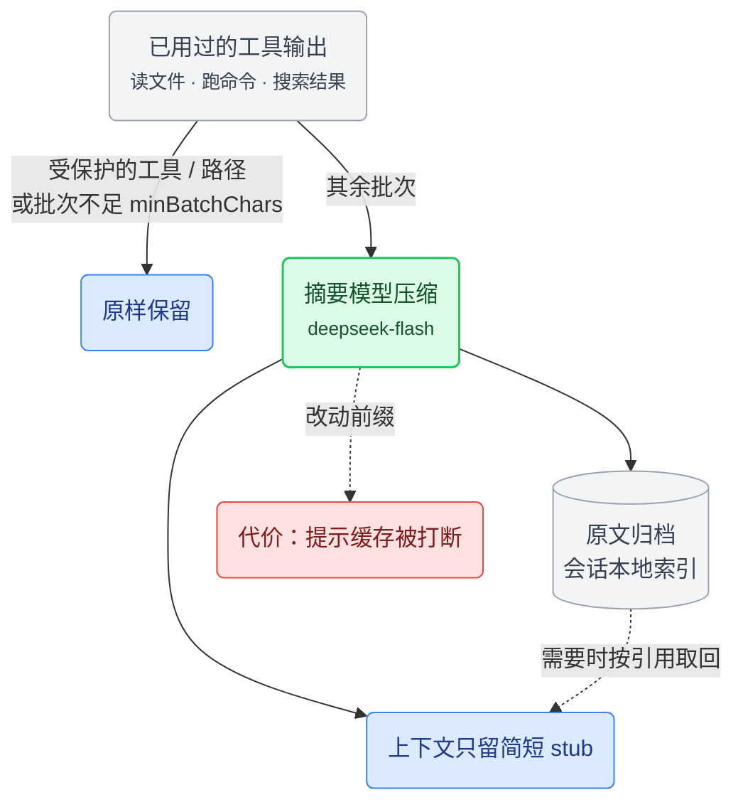

[pi-playbook](../README.md) › [主线](../README.md#文档导航) › **04 高阶阶段**

# 高阶阶段：子代理与剪枝

本阶段的两个插件对 pi 改动最深（定位见 [01-理念与路线.md](01-理念与路线.md)）：子代理带来多代理并行和上下文隔离，剪枝把上下文占用从线性增长压到基本持平。两者都改变了 pi 的工作方式，代价也最明显：子代理要管权限边界，剪枝会让历史细节默认不可见、打断提示缓存。它们放在最后，是因为要靠前面几个阶段打底——比如剪枝的效果要靠缓存监控来验证。

本页内容：[pi-subagents](#tintinwebpi-subagents--子代理系统)（子代理系统）· [pi-condense](#pi-condense--上下文剪枝)（上下文剪枝）· [整体架构](#整体架构)

<br>

## @tintinweb/pi-subagents —— 子代理系统

> **一句话**：主模型用 `Agent` 工具把任务派给独立的子代理会话，可以前台、后台、并行或定时运行\
> **收益**：机械执行的大段输出留在子代理那边，主会话上下文保持干净；执行可以交给便宜模型\
> **代价**：每次委托都有冷启动、重读文件的固定开销；子代理的工具权限等同本机进程，权限边界要自己管\
> **适合**：常做仓库级调研、批量修改、长时间测试的人。**不必装**：任务都小，几次工具调用就能做完\
> **改动深度**：把 pi 从单会话变成多会话协作；新增 `Agent`、`SubagentWorkflow` 等工具和 `/agents` 面板

商店：[pi.dev/packages/@tintinweb/pi-subagents](https://pi.dev/packages/@tintinweb/pi-subagents) · 仓库：[tintinweb/pi-subagents](https://github.com/tintinweb/pi-subagents) · 本机版本 `0.19.0`

pi 默认单模型、单会话，决策和执行挤在同一个上下文里。任务一大，机械执行的部分会吃掉大量上下文和 token，还会干扰决策。

pi-subagents 引入子代理。主代理用 `Agent` 工具把任务派给另一个独立会话，能力包括：

- 前台阻塞、后台异步、并行执行、定时调度；
- 子代理可以再委托（嵌套）；
- 用 git worktree 隔离代码改动；
- 在输入框里用 `@代理名` 直接点名；
- 运行中途用 `steer_subagent` 纠偏。

批量任务的规模要到运行时才知道时，用 `SubagentWorkflow`：模型写一段确定性的 JavaScript 脚本，用 `agent()`、`parallel()`、`pipeline()` 把子代理串成多阶段流水线。

“便宜模型做执行”靠这套机制落地：大任务里的机械部分交给 flash 级子代理，主模型负责决策和汇总。独立会话隔开了上下文，worktree 可以隔开代码改动；工具执行的权限仍然等同于本机进程的系统权限。

0.19.0 要求 Pi 0.84.0 或更新版本。

配置分两层：

- **持久设置**：全局 `~/.pi/agent/subagents.json`，项目里的 `.pi/subagents.json` 可以覆盖。
- **自定义代理**：每个代理一个 Markdown 文件，YAML frontmatter 定义属性，正文就是它的 system prompt。可以放在 `.pi/agents/<name>.md`（项目级，优先级最高）、`.agents/agents/<name>.md`（项目级共享目录）或 `~/.pi/agent/agents/<name>.md`（全局）；同名时项目级覆盖全局。

**我的配置**：没有 subagents.json，持久设置全用默认值：

- `maxConcurrent: 10`、`maxConcurrentForeground: 0`：后台最多并发 10 个，前台不限
- `maxSubagentDepth: 2`：允许子代理再委托一层
- `fallbackSubagent: general-purpose`：找不到指定代理时的兜底
- `backgroundByDefault: true`：未指定时在后台运行
- `workflowsEnabled` 不设：工作流工具自动判断是否启用

唯一的自定义是 `pico` 执行代理（[`config/agents/pico.md`](../config/agents/pico.md)），设计细节见 [06-pico子代理.md](06-pico子代理.md)：

- `model: deepseek/deepseek-flash`、`thinking: high`：固定用 deepseek 的执行档模型
- `prompt_mode: replace`：正文就是完整的 system prompt
- `allowed_subagents` 不写：不开嵌套委托
- `tools`：覆盖了子代理插件识别的全部七个内置工具，所以 Agent 工具描述里显示为 `*`；扩展工具单独加载

### SubagentWorkflow —— 脚本化编排

少量、事先就能确定的独立任务用 `Agent`；批量、多阶段的任务用 `SubagentWorkflow`，以 JavaScript 脚本编排。它可能一次派出大量子代理，所以按使用约定，只有用户明确选择工作流或多代理编排时才运行。

**写法。** 脚本开头必须是纯字面量的 `export const meta = { name, description }`。三个核心函数：

- `agent()`：派发一个子代理；
- `pipeline()`：每一项独立地逐阶段推进；
- `parallel()`：等这一组全部完成再往下走。

优先用 `pipeline()`，只有需要跨项汇总时才用 `parallel()` 这道屏障。`schema` 校验子代理返回的对象，`gate` 用命令的退出码验证结果。

**运行限制。** 脚本在 worker thread 的 `node:vm` 里执行，不能读取当前时间、生成随机数或动态生成代码；需要时间戳就通过 `args` 传进去。并发上限 `max(1, min(16, cpus - 2))`，单次运行最多 1000 个代理，`parallel()` / `pipeline()` 单次最多 4096 项。工作流的并发池和会话的 `maxConcurrent` 相互独立。这些限制是为了保证重放结果确定，安全隔离仍要靠运行环境。

**观察与控制。** 调用后立即返回 task id，工作流在后台运行，完成后走普通的后台通知。`/agents → Workflows` 打开两层面板（阶段 → 代理 → prompt/activity/outcome），快捷键：`x` 停止、`p` 暂停、`s` 跳过（该次 `agent()` 返回 `null`）、`r` 重试、`c` 打开该子代理的对话。

**脚本复用。** 每次调用的脚本都会存到会话目录，改完用 `scriptPath` 重跑。值得保留的脚本放进 `.pi/workflows/`、`.agents/workflows/` 或代理目录的 `workflows/`，之后用 `name` 调用。`resumeFromRunId` 重放同一会话中某次已结束运行里没改动的前缀部分，只在该会话内有效。启动时也可以用 `--subagents-workflow-file=<path>` 直接跑一个脚本。

开关 `workflowsEnabled` 默认开启；不显式设置时处于自动模式，发现别的扩展已经提供了 `Workflow` / `SubagentWorkflow` 工具，就主动让位。

| 参数 | 说明 |
|------|------|
| `script` | 脚本源码 |
| `scriptPath` | 脚本文件路径，优先于 `script` 和 `name` |
| `name` | 已保存的脚本名，在三个 `workflows/` 目录里找 `<name>.js` |
| `args` | 原样传给脚本的 `args` 全局 |
| `resumeFromRunId` | 重放同一会话里某次已结束运行的未变前缀 |

`title` / `description` 两个参数接受但忽略，工作流名字以 `meta` 为准。

### 参数

**常用参数 · subagents.json**

| 参数 | 默认 | 说明 |
|------|------|------|
| `maxConcurrent` | `10` | 同时运行的后台代理数，超出的排队。遇到 API 限流或本机资源紧张时调低。 |
| `maxConcurrentForeground` | `0` | 前台代理的独立并发上限，`0` 表示不限，不占后台名额。本地模型不宜并发时设为 `1`。 |
| `backgroundByDefault` | `true` | 调用未指定运行方式时的处理，嵌套派发默认在前台。<br>· `true`：立即返回任务 ID<br>· `false`：等结果出来再返回 |
| `workflowsEnabled` | `true` | 工作流工具的开关，一般不用设置。<br>· `false`：禁用<br>· `true`：显式启用<br>· 不写：自动判断，其他扩展已提供同类工具就让位 |
| `maxSubagentDepth` | `2` | 嵌套深度上限，主会话算 0、子代理算 1。<br>· `2`：允许子代理再委托一层<br>· `0` / `1`：全局禁止嵌套 |
| `fallbackSubagent` | `general-purpose` | 指定的代理类型不存在、已禁用或有歧义时，改派给这个代理。设为 `none` 则直接报错，避免任务悄悄落到权限更大的代理上。 |

**常用参数 · 代理 frontmatter**

| 参数 | 默认 | 说明 |
|------|------|------|
| `model` | 继承父模型 | 代理用的模型。写 `provider/modelId` 会优先用该渠道，也可以写 haiku、sonnet 这类模糊名；该渠道没有这个模型时，仍可能换到其他渠道。 |
| `tools` | 不设 | 可用的内置工具名列表；`ext:` 选择器只筛选扩展工具，不负责加载扩展。<br>· `*` / `all`：全开<br>· `none`：全关<br>· `ext:扩展`：选一整组扩展工具<br>· `ext:扩展/工具`：选单个扩展工具 |
| `allowed_subagents` | `none` | 能否再委托。子代理的权限各自独立，名单一般只列必需的类型。<br>· `none`：禁止<br>· `all`：允许任意代理<br>· 列表：只允许指定类型 |

<details>
<summary><b>其余参数（37 项）</b></summary>

**subagents.json**

| 参数 | 默认 | 说明 |
|------|------|------|
| `graceTurns` | `5` | 达到轮数上限后，再给几轮用来收尾、给出结论。调小止损更快，调大收尾更完整。 |
| `defaultMaxTurns` | 不限 | 代理没设 `max_turns` 时的轮数上限，防止任务无限运行；达到上限后仍有宽限轮。 |
| `scheduling` | `true` | 开启后可以用 `schedule` 延迟或周期派发。用不到定时任务就关掉，免得模型误排计划。 |
| `agentMentions` | `model` | 用 @ 启动新代理的方式；在 `model` 和 `direct` 下，已有的代理都直接收到消息。<br>· `model`：交给模型组织派发<br>· `direct`：直接启动<br>· `off`：禁用提及 |
| `rememberAgents` | `true` | 保存子代理会话，之后可以用 `/resume` 或再次 @ 续接。关闭后，内存里的记录一过期就无法续接。 |
| `reportUsage` | `false` | 把子代理的 token 和费用计入主会话统计。想看任务总成本时开，只看主模型时关。 |
| `showCost` | `false` | 在子代理界面显示估算费用，便于比较模型成本；不影响主会话的费用统计。 |
| `showModel` | `false` | 在运行挂件上显示模型和思考档位。混用多个模型时开；终端较窄或只用一个模型时可关。 |
| `viewerMarkdown` | `assistant` | 查看器的 Markdown 渲染；要看日志或 diff 的原始格式时选 `off`。<br>· `off`：显示原始文本<br>· `assistant`：只渲染助手消息<br>· `all`：连工具输出也渲染 |
| `outputTranscript` | `true` | 把完整对话另存为 `.output` 文件，便于审计。关闭只是不再写这份转录，会话和记忆照常落盘。 |
| `disableDefaultAgents` | `false` | 隐藏内置的 general-purpose、Explore、Plan，只显示自定义代理。要彻底禁止兜底派发，还得把 `fallbackSubagent` 设为 `none`。 |
| `scopeModels` | `false` | 用 `enabledModels` 限制调用方指定的模型。代理文件里固定或继承的模型越界时只会警告，所以不能当作硬性的费用隔离。 |
| `strictAgentFiles` | `false` | 开启后，代理文件读取或解析失败会阻止扩展启动；关闭时只警告并跳过。会话中重载始终只警告。 |
| `worktreeIsolation` | `true` | 允许新建 worktree 隔离改动。关闭能省下复制的时间和磁盘，但要求隔离的任务会退回当前目录执行。 |
| `joinMode` | `smart` | 多个代理完成时怎么通知；想边收结果边处理就选 `async`。<br>· `smart`：合并同一轮的通知<br>· `async`：完成一个通知一个<br>· `group`：强制分组 |
| `toolDescriptionMode` | `full` | 给模型的派发说明，修改后新会话才生效。<br>· `full`：完整说明<br>· `compact`：精简说明，省上下文<br>· `custom`：读自定义说明文件 |
| `widget` | `background` | 运行挂件显示哪些任务。<br>· `all`：全部<br>· `background`：只显示后台任务，避免与前台输出重复<br>· `off`：隐藏挂件，仍可在 `/agents` 查看 |

`scopeModels` 只识别精确的 `provider/modelId`，不识别 glob 或思考后缀；清单为空时不校验。`toolDescriptionMode: custom` 从项目 `.pi/agent-tool-description.md` 或全局 `~/.pi/agent/agent-tool-description.md` 读取，项目优先；文件缺失或为空则退回 `full`。

**代理 frontmatter**（全字段可选）

| 参数 | 默认 | 说明 |
|------|------|------|
| `name` | 文件名 | 派发和 @ 时用的类型名，不能含 `:`。需要稳定的调用名时显式指定，它不受界面显示名影响。 |
| `display_name` | 类型名 | 挂件和列表里显示的名字，可以写中文角色名，不影响 `name` 的派发身份。 |
| `description` | 不设 | 模型挑选代理时看到的说明。写清擅长什么、不适合什么，比笼统写“专家”有用。 |
| `color` | 不设 | 代理徽章的底色，可写 `blue` 等颜色名或带引号的 `"#8B5CF6"`。只用来区分角色，不影响行为。 |
| `memory` | 不开启 | 持久记忆的范围；不写就不开启，代理没有写工具时记忆只读。<br>· `project`：存在项目内，共享<br>· `local`：存在项目内，仅个人<br>· `user`：跨项目复用 |
| `thinking` | 继承 | 思考档位。档位越高通常越耗时、越耗 token；机械任务先试 `off` / `low`，复杂推理再升档。模型不支持的档位会向下调整。 |
| `max_turns` | 不设 | 该代理的轮数上限，`0` 表示不限。短任务设小一点，防止绕圈；到上限先收尾，宽限轮也用完才中止。 |
| `extensions` | `true` | 要加载的扩展；轻量代理可以关掉，依赖联网等扩展能力时按需列出。<br>· `true`：加载默认扩展<br>· `false`：不加载<br>· 列表：只加载指定扩展 |
| `exclude_extensions` | 不设 | 从已选扩展中再排除指定的几个，排除优先。适合默认全开、只想去掉某个通知或界面扩展的情况。 |
| `skills` | `true` | 技能的继承方式。<br>· `true`：继承父代理的技能<br>· `false`：不继承<br>· 列表：只把指定技能的全文预载进提示，其余不再继承 |
| `disallowed_tools` | 不设 | 最终禁用的工具名，扩展提供的同名工具也会被禁。用来从较宽的工具列表里去掉写入等能力。 |
| `isolated` | `false` | 强制只用内置工具，不加载扩展和技能。适合输入已经齐全的封闭任务；它不是文件系统沙箱。 |
| `isolation` | `off` | 代码改动在哪里进行；注意副本看不到未提交的改动。<br>· `worktree`：在仓库副本里改代码，结果提交到独立分支<br>· `off`：始终在当前目录运行 |
| `prompt_mode` | `replace` | 正文的用法；专职代理用 `replace`，需要共享规范时用 `append`。<br>· `replace`：把正文当作完整提示，不继承父级 AGENTS.md<br>· `append`：在父级提示后追加角色规则 |
| `inherit_context` | `false` | 开启后复制父会话的对话，省去交代背景，但输入成本更高。任务独立、说明完整时保持 `false`。 |
| `run_in_background` | 跟随调用参数 | 该代理固定的运行方式。<br>· `true`：固定在后台运行<br>· `false`：固定在前台等待<br>· 不写：由调用参数或 `backgroundByDefault` 决定 |
| `persist_session` | 跟随 `rememberAgents` | 覆盖 `rememberAgents`，单独决定该代理是否保存可续接的会话。临时任务可以关；`.output` 转录由另一个开关控制。 |
| `output_transcript` | 跟随 `outputTranscript` | 覆盖 `outputTranscript`，单独决定该代理是否写完整转录。关闭不影响会话持久化，敏感任务要两项分别检查。 |
| `session_dir` | pi 默认位置 | 持久化会话的存放目录，相对路径从代理的工作目录算起。一般留空，需要单独归档时再设。 |
| `enabled` | `true` | 设为 `false` 隐藏该代理。可以在项目里禁用某个全局或内置代理，不必删文件。 |

frontmatter 中已写明的模型、思考档位、轮数、上下文继承和运行方式优先于调用参数。`tools: none` 只关内置工具，不会自动关闭扩展工具；出现任一 `ext:` 选择器后，扩展工具才按显式名单筛选。`exclude_extensions` 和 worktree 都不是安全沙箱，不应用来隔离不可信代码。

</details>

<br>

## pi-condense —— 上下文剪枝

> **一句话**：把用过的工具输出逐批压成摘要，原文归档，需要时按引用取回\
> **收益**：上下文占用从线性增长变为基本持平，长会话撑得下去，少走整体 compact 这条信息损失最大的路\
> **代价**：历史细节默认不可见，要靠模型主动取回；每批摘要多一次模型调用；剪枝改动前缀，打断提示缓存\
> **适合**：常跑长会话、上下文经常逼近上限的人。**不必装**：会话都很短，或更在意缓存命中率\
> **改动深度**：直接改写发给模型的上下文，是全套配置里改动最深的插件；装完默认关闭，要手动开启

商店：[pi.dev/packages/pi-condense](https://pi.dev/packages/pi-condense) · 仓库：[jjuraszek/pi-condense](https://github.com/jjuraszek/pi-condense) · 本机版本 `2.11.5`

上下文是长会话里最贵的资源。pi 默认让工具输出一直占着上下文：读过的大文件、跑过的命令、搜过的结果全堆在窗口里，越聊越贵、越聊越慢，最后触发 compact，把整个会话压成一段摘要——这是信息损失最大的处理方式。

pi-condense 改为逐批归档。每次 flush 时，已经用过的工具输出交给摘要模型压成简短的 stub，原文归档到会话本地的索引里；模型需要时，用 `context_tree_query` 按引用取回。历史细节平时不占上下文，要用时又拿得回来，上下文占用因此从线性增长变为基本持平，长会话才撑得下去。



代价有三项：

- 历史细节默认不可见，要靠模型主动按引用取回；
- 每批摘要都要额外调用一次模型；
- 剪枝会改动前缀，打断提示缓存。

三项都会落到成本上，其中缓存打断影响最大。所以剪枝怎么触发、摘要模型怎么选，是这个插件最需要斟酌的配置。

插件默认关闭，装完要设 `enabled: true`（或在会话里执行 `/pruner on`）才会工作。配置写在 `settings.json` 的 `contextPrune` 段。会话里用 `/pruner` 系列命令操作：

- `/pruner on`、`/pruner off`：开关剪枝
- `/pruner status`：查看状态、摘要模型、触发方式、分批方式和统计
- `/pruner stats`：摘要模型累计的 token 和费用
- `/pruner tree`：在折叠树里浏览已剪枝的工具调用
- `/pruner now`：立即处理待剪枝的工具调用
- `/pruner compact`：对所有已结束的任务链补做链压缩，不受 `rollingWindow` 限制
- `/pruner settings`：打开交互式设置面板
- `/pruner <子命令> [值]`：查看或修改单项设置，子命令有 `model`、`thinking`、`prune-on`、`batching`、`min-batch-chars`、`recovery-grace`、`dedup`、`protected-tools`、`protected-paths`；不带值时显示当前设置或打开交互选择
- `/pruner help`：显示帮助

**我的配置**（settings.json 的 contextPrune 段，完整文件见 [`config/settings.json`](../config/settings.json)）：

```json
{
  "enabled": true,
  "showPruneStatusLine": false,
  "summarizerModel": "deepseek/deepseek-flash",
  "summarizerThinking": "off",
  "pruneOn": "agent-message",
  "batchingMode": "agent-message",
  "quietOversizedSkips": true,
  "minBatchChars": 8000,
  "recoveryGraceTurns": 3,
  "summarizerIdleTimeoutMs": 20000,
  "summarizerMaxTimeoutMs": 100000,
  "protectedTools": [
    "ask_user_question",
    "Agent",
    "get_subagent_result",
    "web_search",
    "source_check",
    "get_search_content"
  ],
  "protectedPaths": ["**/skills/**/*.md"],
  "chainCompression": {
    "enabled": false,
    "rollingWindow": 3,
    "stripFinalAssistantThinking": true,
    "fuseRangeSummary": true
  },
  "purgeErrors": {
    "enabled": true,
    "cooldownTurns": 2,
    "minArgChars": 500
  },
  "dedupByContentHash": true,
  "autoBudgetThreshold": null,
  "spillThreshold": 16384,
  "spillPreviewBytes": 2048,
  "budgetTurnDelta": null,
  "frontierGapThresholdTokens": null
}
```

> [!WARNING]
> **调剪枝参数时，同时盯住缓存命中率和摘要成本。** 剪枝会改动会话前缀，影响后续请求能否复用缓存。摘要模型、批量门槛、链压缩开关和 spill 阈值一起决定成本与延迟；改完用 `/pruner status` 和 `/cache graph` 看实际效果。

几个关键取舍：

- `summarizerModel: deepseek/deepseek-flash`、`summarizerThinking: off`：与 pico、会话命名共用同一个执行档模型。区别在思考档位：pico 开 high，摘要不请求推理档位，优先压低延迟和成本。
- `minBatchChars: 8000`：门槛比默认的 2000 高，小批次不再送去摘要，免得花钱生成和原文差不多长的摘要。不足 8000 字符的批次直接跳过，不会累积到下一次。
- `chainCompression.enabled: false`：链级压缩会改写滚动窗口之外的历史链，破坏前缀缓存里原本稳定的部分。现有剪枝已经够用，关掉它换取更高的缓存命中率，效果可以在 pi-cache-graph 里验证。
- `protectedTools`：保护六个工具，`ask_user_question`（提问）、`Agent`、`get_subagent_result`（子代理）、`web_search`、`source_check`、`get_search_content`（联网）。它们的输出是决策的关键依据，剪掉后模型就失去了判断基础。2.10.3 起有个例外：带字符串 `path` 参数的受保护调用，同一路径只保留最新一次读取，更早的换成 `[Superseded: …]` stub。这六个工具基本不带 `path` 参数，这条规则主要作用在 `protectedPaths` 上。
- `protectedPaths: ["**/skills/**/*.md"]`：只保留技能文件一条。2.10.2 起插件默认值是 `["**/skills/**/*.md", "**/gauntlet-overrides.md"]`，显式配置会整体替换默认值。当前只列了技能文件，gauntlet 覆盖文件因此不受保护。
- `spillThreshold: 16384`：默认是 65536。降低后，超大输出更早转存到旁路文件，上下文里只留 2KB 预览。
- `summarizerMaxTimeoutMs: 100000`：默认是 180000。廉价档模型做摘要足够快，缩短超时可以避免断断续续的慢速输出拖慢剪枝。

### 参数

**常用参数**

| 参数 | 默认 | 说明 |
|------|------|------|
| `enabled` | `false` | 开启工具输出剪枝，只处理开启之后捕获的批次。关闭后不再剪枝，但图片上限保护仍然生效。 |
| `summarizerModel` | `default` | `default` 沿用当前模型；填 `provider/model-id` 可以单独选一个便宜、快速的摘要模型，降低每批剪枝的费用和等待。 |
| `minBatchChars` | `2000` | 批次原文不足 N 字符就跳过，不会留到下次凑数。调高可省掉小批次的摘要费用，`0` 让所有批次都尝试摘要。 |
| `pruneOn` | `agent-message` | 何时剪枝；想自己控制缓存何时失效时选 `on-demand`。<br>· `agent-message`：在助手给出最终纯文本回复后自动剪枝<br>· `on-demand`：只在执行 `/pruner now` 时剪枝 |
| `protectedTools` | `[]` | 按精确工具名保留原文，适合计划、句柄这类要反复读取的结果。带 `path` 参数的调用，同一路径只保留最新一次。 |
| `spillThreshold` | `65536` | 单条输出达到 N 字符就直接转存文件，不做摘要。调低能少占上下文，但模型更常需要回头读文件。 |

<details>
<summary><b>其余参数（21 项）</b></summary>

**主开关与触发**

| 参数 | 默认 | 说明 |
|------|------|------|
| `autoBudgetThreshold` | `null` | 上下文占用达到指定比例时强制剪枝，如 `0.8` 表示 80%，触发点最高按 30 万 token 计。`null` 表示关闭；长时间的单轮任务可以开启。 |
| `budgetTurnDelta` | `null` | 单轮增长超过窗口的指定比例时强制剪枝，窗口最多按 30 万 token 计算，例如 `0.1` 在大窗口上相当于增长 3 万 token。`null` 表示关闭。 |
| `frontierGapThresholdTokens` | `null` | 未剪枝的尾部达到 N token 时，在轮末剪枝。适合大窗口的长任务，可以从 80000 试起；调低剪得更频繁，`null` 表示关闭。 |
| `showPruneStatusLine` | `true` | 在底栏显示剪枝状态。调参时打开，想省出空间时关闭；统计仍可用 `/pruner status` 查看。 |

`pruneOn` 决定何时处理，`batchingMode` 决定如何分组，两者互不影响。`autoBudgetThreshold`、`budgetTurnDelta`、`frontierGapThresholdTokens` 三个阈值是额外的触发器，选了 `on-demand` 也照样生效；要完全手动剪枝，得把这三项都设为 `null`。

**摘要模型**

| 参数 | 默认 | 说明 |
|------|------|------|
| `summarizerThinking` | `default` | 摘要模型的思考档位，摘要一般先试 `off`。<br>· `default`：沿用提供方默认<br>· `off`：不请求推理档位<br>· 其余档位：逐级增加思考预算 |
| `summarizerIdleTimeoutMs` | `20000` | 连续多少毫秒收不到流事件就中止，也限制首 token 的等待时间。慢模型可以调高，`0` 禁用空闲超时。 |
| `summarizerMaxTimeoutMs` | `180000` | 单次摘要的总时长上限（毫秒），防止输出断断续续却一直不结束。`0` 表示禁用；应设得比空闲超时长。 |

**批量与质量门**

| 参数 | 默认 | 说明 |
|------|------|------|
| `batchingMode` | `turn` | 怎么分批摘要。<br>· `turn`：每个助手轮次分别摘要<br>· `agent-message`：把从用户提问到最终回复之间的输出合成一批，调用次数更少，但单批更大 |
| `quietOversizedSkips` | `false` | 隐藏“批次太小”和“摘要比原文还长”这两类跳过通知。只减少界面噪音，不改变剪枝规则。 |
| `dedupByContentHash` | `true` | 与已归档内容重复的输出直接改为引用，不再调用摘要模型。调试重复读取、需要并排保留原文时关闭。 |
| `recoveryGraceTurns` | `3` | 取回的原文保留几个用户轮次后再变回引用。调高可减少反复取回，调低节省上下文，`0` 立即变回引用。 |

**保护、转存与图片**

| 参数 | 默认 | 说明 |
|------|------|------|
| `protectedPaths` | `["**/skills/**/*.md", "**/gauntlet-overrides.md"]` | 按调用参数 `path` 做 glob 匹配，保留规则文件等重要内容。显式写的列表会整体替换默认值，`[]` 取消路径保护。 |
| `spillPreviewBytes` | `2048` | 转存后仍留在上下文里的开头预览，单位是字节而不是字符。调大便于判断内容，调小节省空间。 |
| `maxImagesPerRequest` | `null` | 每次请求最多保留最近 N 张图，更早的图换成文字提示。提供方报图片超限时调低；`null` 使用内置上限，见下文。 |

图片上限即使在 `enabled: false` 时也生效：`null` 对 Anthropic Messages 使用 100 张上限，其他 API 不限。清理按 N 的一半分档，可能一次移除多张旧图，避免每轮都改写缓存前缀。

**链压缩**（写在 `chainCompression` 对象里）

| 参数 | 默认 | 说明 |
|------|------|------|
| `enabled` | `true` | 对旧的完整任务链（从用户提问到最终回复）再做一层压缩。更省上下文，但会改写更多前缀；优先保缓存时可以关掉。 |
| `rollingWindow` | `3` | 最近 N 条已结束的任务链不做链压缩。调大保留更多近期过程，调小更省上下文；仅在链压缩开启时生效。 |
| `stripFinalAssistantThinking` | `true` | 链压缩时去掉最终回复附带的思考块，只保留回答正文。需要回查旧的推理过程时关闭。 |
| `fuseRangeSummary` | `true` | 把同一条链的多批摘要融合成一条，会额外调用摘要模型；关闭则直接拼接已有摘要，省钱，但内容可能重复。 |

**错误清理**（写在 `purgeErrors` 对象里）

| 参数 | 默认 | 说明 |
|------|------|------|
| `enabled` | `true` | 把失败工具调用的大段输入参数换成短标记，避免失败重试越堆越多。它不删除错误结果；排错需要保留原参数时关闭。 |
| `cooldownTurns` | `2` | 失败后等 N 个轮次再清理参数。调大给模型更多时间纠错，调小更快回收上下文。 |
| `minArgChars` | `500` | 只清理超过 N 字符的失败调用参数。调高会保留中等长度的输入，调低清理得更积极。 |

</details>

<br>

## 整体架构

四类插件全部装好后，整体结构如下（比 [01](01-理念与路线.md) 里的版本多了 SubagentWorkflow）：


有两处联动要留意：什么时候委托给 pico，规则写在全局 AGENTS.md 里（[07-全局指令.md](07-全局指令.md)）；剪枝改动前缀会直接影响缓存命中，这层关系可以在 pi-cache-graph 里观察（[03-进阶阶段.md](03-进阶阶段.md)）。

---

← [03 进阶阶段](03-进阶阶段.md) · [返回目录](../README.md#文档导航) · [05 界面与观测](05-界面与观测.md) →
