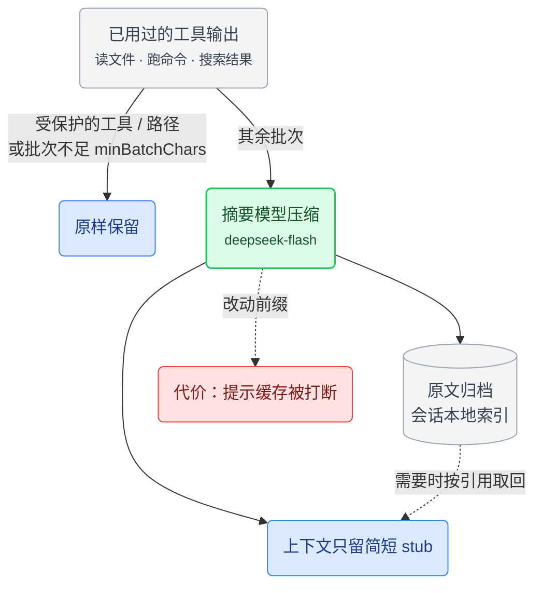
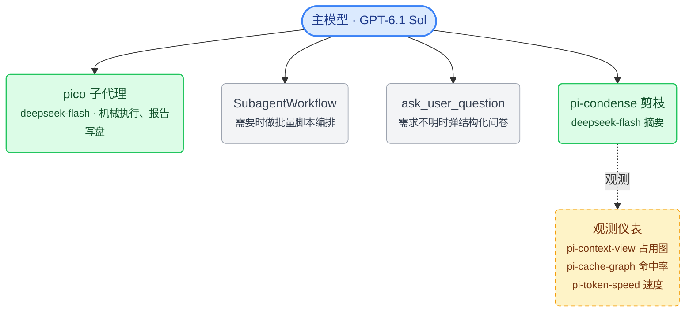

[pi-playbook](../README.md) › [主线](../README.md#文档导航) › **04 高阶阶段**

# 高阶阶段：子代理与剪枝

本阶段的两个插件对 pi 改动最深（定位见 [01-理念与路线.md](01-理念与路线.md)）：子代理带来多代理并行和上下文隔离，剪枝把上下文占用从线性增长压到基本持平。两者都改变了 pi 的工作方式，代价也最明显：子代理要管权限边界，剪枝会让历史细节默认不可见、打断提示缓存。它们放在最后，是因为要靠前面几个阶段打底——比如剪枝的效果要靠缓存监控来验证。

本页内容：[pi-subagents](#tintinwebpi-subagents--子代理系统)（子代理系统）· [pi-condense](#pi-condense--上下文剪枝)（上下文剪枝）· [整体架构](#整体架构)

<br>

## @tintinweb/pi-subagents —— 子代理系统

> **一句话**：主模型用 `Agent` 工具把任务派给独立的子代理会话，可以前台、后台、并行或定时运行\
> **收益**：机械执行的大段输出留在子代理那边，主会话上下文保持干净；执行可以交给便宜模型\
> **代价**：每次委托都有冷启动、重读文件的固定开销；子代理的工具权限等同本机进程，权限边界要自己管\
> **适合**：常做仓库级调研、批量修改、长时间测试的人。**不必装**：任务都小，几次工具调用就能做完\
> **改动深度**：把 pi 从单会话变成多会话协作；新增 `Agent`、`SubagentWorkflow` 等工具和 `/agents` 面板

商店：[pi.dev/packages/@tintinweb/pi-subagents](https://pi.dev/packages/@tintinweb/pi-subagents) · 仓库：[tintinweb/pi-subagents](https://github.com/tintinweb/pi-subagents) · 本机版本 `0.19.0`

pi 默认单模型、单会话，决策和执行挤在同一个上下文里。任务一大，机械执行的部分会吃掉大量上下文和 token，还会干扰决策。

pi-subagents 引入子代理。主代理用 `Agent` 工具把任务派给另一个独立会话，能力包括：

- 前台阻塞、后台异步、并行执行、定时调度；
- 子代理可以再委托（嵌套）；
- 用 git worktree 隔离代码改动；
- 在输入框里用 `@代理名` 直接点名；
- 运行中途用 `steer_subagent` 纠偏。

批量任务的规模要到运行时才知道时，用 `SubagentWorkflow`：模型写一段确定性的 JavaScript 脚本，用 `agent()`、`parallel()`、`pipeline()` 把子代理串成多阶段流水线。

“便宜模型做执行”靠这套机制落地：大任务里的机械部分交给 flash 级子代理，主模型负责决策和汇总。独立会话隔开了上下文，worktree 可以隔开代码改动；工具执行的权限仍然等同于本机进程的系统权限。

0.19.0 要求 Pi 0.84.0 或更新版本。

配置分两层：

- **持久设置**：全局 `~/.pi/agent/subagents.json`，项目里的 `.pi/subagents.json` 可以覆盖。
- **自定义代理**：每个代理一个 Markdown 文件，YAML frontmatter 定义属性，正文就是它的 system prompt。可以放在 `.pi/agents/<name>.md`（项目级，优先级最高）、`.agents/agents/<name>.md`（项目级共享目录）或 `~/.pi/agent/agents/<name>.md`（全局）；同名时项目级覆盖全局。

**我的配置**：没有 subagents.json，持久设置全用默认值——后台并发 10、前台不限、嵌套深度 2、兜底代理 general-purpose、未指定时后台运行、工作流自动判断。

唯一的自定义是 `pico` 执行代理（[`config/agents/pico.md`](../config/agents/pico.md)）：模型固定为 deepseek 的 `deepseek-flash`，thinking high，`prompt_mode: replace`，不开嵌套委托。它的 `tools` 覆盖了子代理插件识别的全部七个内置工具，所以 Agent 工具描述里显示为 `*`；扩展工具单独加载，嵌套委托由 `allowed_subagents` 控制。设计细节见 [06-pico子代理.md](06-pico子代理.md)。

### 参数

**常用参数 · subagents.json**

| 参数 | 默认 | 说明 |
|------|------|------|
| `maxConcurrent` | `10` | 同时运行的后台代理数，超出排队；遇到 API 限流或本机资源吃紧时调低。 |
| `maxConcurrentForeground` | `0` | 前台代理单独限流，`0` 不限；本地模型不宜并发时设为 `1`，不会占用后台池。 |
| `backgroundByDefault` | `true` | 未指定时，`true` 立即返回任务 ID，`false` 等结果再返回；嵌套派发默认前台。 |
| `workflowsEnabled` | `true` | `false` 禁用工作流工具，`true` 显式启用；不写则自动避让其他扩展的同类工具，通常不必设置。 |
| `maxSubagentDepth` | `2` | 主会话算 0、子代理算 1；`2` 允许再委托一层，`0` / `1` 全局禁用嵌套。 |
| `fallbackSubagent` | `general-purpose` | 类型名不存在、禁用或有歧义时，改派指定代理；设 `none` 直接报错，避免悄悄派给权限更大的代理。 |

**常用参数 · 代理 frontmatter**

| 参数 | 默认 | 说明 |
|------|------|------|
| `model` | 继承父模型 | 用 `provider/modelId` 优先指定渠道，或用 haiku/sonnet 等模糊名；该渠道无此模型时仍可能改用其他渠道。 |
| `tools` | 不设 | 列内置工具名；`*` / `all` 全开，`none` 全关。`ext:扩展` 选整组、`ext:扩展/工具` 选单项，但都不负责加载扩展。 |
| `allowed_subagents` | `none` | `none` 禁止再委托，`all` 允许任意代理，列表只准指定类型；子代理权限独立，通常用最小名单。 |

<details>
<summary><b>其余参数（37 项）</b></summary>

**subagents.json**

| 参数 | 默认 | 说明 |
|------|------|------|
| `graceTurns` | `5` | 达到轮数上限后，再给几轮输出结论；调小能更快止损，调大更利于完整收尾。 |
| `defaultMaxTurns` | 不限 | 未单独设 `max_turns` 时的轮数上限；防止任务无限运行，达到后仍有宽限轮次。 |
| `scheduling` | `true` | 开启后可用 `schedule` 延迟或周期派发；不需要定时任务时关闭，避免模型误排计划。 |
| `agentMentions` | `model` | 启动新代理时，`model` 让模型组织派发，`direct` 直接启动；`off` 禁用代理提及。已有代理在前两种模式下都直接收消息。 |
| `rememberAgents` | `true` | 保存子代理会话，便于 `/resume` 或再次 @ 续接；关闭后内存记录过期就不能再续接。 |
| `reportUsage` | `false` | 把子代理 token 和成本并入主会话统计；想看任务总成本时开，只看主模型时关。 |
| `showCost` | `false` | 在子代理界面显示估算费用，方便比较模型成本；不影响主会话的费用统计。 |
| `showModel` | `false` | 运行挂件显示模型和思考档位；混用多个模型时开，窄终端或固定模型时可关。 |
| `viewerMarkdown` | `assistant` | `off` 看原始文本；`assistant` 只格式化助手消息；`all` 也格式化工具输出。排查日志或 diff 原始格式时选 `off`。 |
| `outputTranscript` | `true` | 将完整对话另存为 `.output` 文件，便于审计；关闭只停写转录，不会禁用会话或记忆落盘。 |
| `disableDefaultAgents` | `false` | 隐藏内置 general-purpose、Explore、Plan，只展示自定义代理；要严格禁止兜底，还需将 `fallbackSubagent` 设为 `none`。 |
| `scopeModels` | `false` | 按 `enabledModels` 限制调用者指定的模型；代理文件固定或继承的模型越界只警告，不能用作硬性费用隔离。 |
| `strictAgentFiles` | `false` | 开启后，代理文件不可读或解析失败会阻止扩展启动；关闭则警告并跳过。会话中重载始终只警告。 |
| `worktreeIsolation` | `true` | 允许另建 worktree 隔离改动；关闭能省复制时间和磁盘，但隔离请求会退回当前工作目录执行。 |
| `joinMode` | `smart` | `smart` 合并同轮多代理的通知；`async` 完成一个通知一个；`group` 强制分组。要边收结果边处理时选 `async`。 |
| `toolDescriptionMode` | `full` | `full` 给模型完整派发指导；`compact` 缩短提示省上下文；`custom` 读自定义说明文件。均需新会话生效。 |
| `widget` | `background` | `all` 展示全部任务；`background` 只看后台任务，避免与前台输出重复；`off` 隐藏挂件，仍可用 `/agents` 查看。 |

`scopeModels` 只识别精确的 `provider/modelId`，不识别 glob 或思考后缀；清单为空时不校验。`toolDescriptionMode: custom` 从项目 `.pi/agent-tool-description.md` 或全局 `~/.pi/agent/agent-tool-description.md` 读取，项目优先；文件缺失或为空则退回 `full`。

**代理 frontmatter**（全字段可选）

| 参数 | 默认 | 说明 |
|------|------|------|
| `name` | 文件名 | 派发和 @ 使用的类型名，不能含 `:`；需要稳定调用名时指定，不受界面显示名影响。 |
| `display_name` | 类型名 | 挂件和列表中的显示名；可写中文角色名，不改变 `name` 的派发身份。 |
| `description` | 不设 | 模型挑选代理时看到的说明；写清擅长任务和不适用范围，比泛泛写“专家”更有用。 |
| `color` | 不设 | 代理徽章底色，支持 `blue` 等色名或加引号的 `"#8B5CF6"`；只用于区分角色，不影响行为。 |
| `memory` | 不开启 | `project` 存项目内共享记忆，`local` 存项目内个人记忆，`user` 跨项目复用；不写不开启，无写工具时只读。 |
| `thinking` | 继承 | 越高通常越耗时、耗 token；机械任务先试 `off` / `low`，复杂推理再升档。不支持的档位会向下调整。 |
| `max_turns` | 不设 | 该代理的轮数上限，`0` 不限；短任务设小值防止绕圈，到限先收尾，再耗尽宽限才中止。 |
| `extensions` | `true` | `true` 加载默认扩展，`false` 不加载，列表只加载指定项；轻量代理可关，依赖联网等能力时按需列出。 |
| `exclude_extensions` | 不设 | 在已选扩展中再排除指定名称，排除优先；适合默认全开但不想加载某个通知或 UI 扩展。 |
| `skills` | `true` | `true` 继承父代理技能，`false` 不继承；列表仅把指定技能全文预载到提示中，不再继承其余技能。 |
| `disallowed_tools` | 不设 | 按工具名最终禁用，扩展提供的同名工具也受限；用于从较宽的工具列表中扣掉写入等能力。 |
| `isolated` | `false` | 强制只用内置工具，不加载扩展和技能；适合输入已齐备的封闭任务，不代表文件系统沙箱。 |
| `isolation` | `off` | `worktree` 在仓库副本中改代码，结果提交到独立分支；`off` 始终在当前目录运行。副本看不到未提交改动。 |
| `prompt_mode` | `replace` | `replace` 把正文当完整提示，不继承父 AGENTS.md；`append` 在父提示后补充角色规则。专职代理选前者，共享规范选后者。 |
| `inherit_context` | `false` | 开启后复制父对话，省去手动交代背景但增加输入成本；独立、说明完整的任务保留 `false`。 |
| `run_in_background` | 跟随调用参数 | `true` 固定后台，`false` 固定前台等待；不写才由调用参数或 `backgroundByDefault` 决定。 |
| `persist_session` | 跟随 `rememberAgents` | 覆盖 `rememberAgents`，决定该代理是否保存可续接会话；临时任务可关，`.output` 转录仍由另一开关控制。 |
| `output_transcript` | 跟随 `outputTranscript` | 覆盖 `outputTranscript`，决定该代理是否写完整转录；关闭不影响会话持久化，敏感任务需分别检查两项。 |
| `session_dir` | pi 默认位置 | 持久化会话的存放目录，相对路径从代理工作目录解析；一般留空，单独归档时再改。 |
| `enabled` | `true` | `false` 隐藏该代理；可在项目里禁用某个全局或内置代理，而不用删文件。 |

frontmatter 中已写明的模型、思考档位、轮数、上下文继承和运行方式优先于调用参数。`tools: none` 只关内置工具，不会自动关闭扩展工具；出现任一 `ext:` 选择器后，扩展工具才按显式名单筛选。`exclude_extensions` 和 worktree 都不是安全沙箱，不应用来隔离不可信代码。

</details>

### SubagentWorkflow —— 脚本化编排

少量、事先就能确定的独立任务用 `Agent`；批量、多阶段的任务用 `SubagentWorkflow`，以 JavaScript 脚本编排。它可能一次派出大量子代理，所以使用约定要求：用户明确选择工作流或多代理编排后才运行。

**写法。** 脚本开头必须是纯字面量的 `export const meta = { name, description }`。三个核心函数：

- `agent()`：派发一个子代理；
- `pipeline()`：每一项独立地逐阶段推进；
- `parallel()`：等这一组全部完成再往下走。

优先用 `pipeline()`，只有需要跨项汇总时才用 `parallel()` 这道屏障。`schema` 校验子代理返回的对象，`gate` 用命令的退出码验证结果。

**运行限制。** 脚本在 worker thread 的 `node:vm` 里执行，不能读取当前时间、生成随机数或动态生成代码；需要时间戳就通过 `args` 传进去。并发上限 `max(1, min(16, cpus - 2))`，单次运行最多 1000 个代理，`parallel()` / `pipeline()` 单次最多 4096 项。工作流的并发池和会话的 `maxConcurrent` 相互独立。这些限制是为了保证重放结果确定，安全隔离仍要靠运行环境。

**观察与控制。** 调用后立即返回 task id，工作流在后台运行，完成后走普通的后台通知。`/agents → Workflows` 打开两层面板（阶段 → 代理 → prompt/activity/outcome），快捷键：`x` 停止、`p` 暂停、`s` 跳过（该次 `agent()` 返回 `null`）、`r` 重试、`c` 打开该子代理的对话。

**脚本复用。** 每次调用的脚本都会存到会话目录，改完用 `scriptPath` 重跑。值得保留的脚本放进 `.pi/workflows/`、`.agents/workflows/` 或代理目录的 `workflows/`，之后用 `name` 调用。`resumeFromRunId` 重放同一会话中某次已结束运行里没改动的前缀部分，只在该会话内有效。启动时也可以用 `--subagents-workflow-file=<path>` 直接跑一个脚本。

开关 `workflowsEnabled` 默认开启；不显式设置时处于自动模式，发现别的扩展已经提供了 `Workflow` / `SubagentWorkflow` 工具，就主动让位。

| 参数 | 说明 |
|------|------|
| `script` | 脚本源码 |
| `scriptPath` | 脚本文件路径，优先于 `script` 和 `name` |
| `name` | 已保存的脚本名，在三个 `workflows/` 目录里找 `<name>.js` |
| `args` | 原样传给脚本的 `args` 全局 |
| `resumeFromRunId` | 重放同一会话里某次已结束运行的未变前缀 |

`title` / `description` 两个参数接受但忽略，工作流名字以 `meta` 为准。

<br>

## pi-condense —— 上下文剪枝

> **一句话**：把用过的工具输出逐批压成摘要，原文归档，需要时按引用取回\
> **收益**：上下文占用从线性增长变为基本持平，长会话撑得下去，少走整体 compact 这条信息损失最大的路\
> **代价**：历史细节默认不可见，要靠模型主动取回；每批摘要多一次模型调用；剪枝改动前缀，打断提示缓存\
> **适合**：常跑长会话、上下文经常逼近上限的人。**不必装**：会话都很短，或更在意缓存命中率\
> **改动深度**：直接改写发给模型的上下文，是全套配置里改动最深的插件；装完默认关闭，要手动开启

商店：[pi.dev/packages/pi-condense](https://pi.dev/packages/pi-condense) · 仓库：[jjuraszek/pi-condense](https://github.com/jjuraszek/pi-condense) · 本机版本 `2.11.5`

上下文是长会话里最贵的资源。pi 默认让工具输出一直占着上下文：读过的大文件、跑过的命令、搜过的结果全堆在窗口里，越聊越贵、越聊越慢，最后触发 compact，把整个会话压成一段摘要——这是信息损失最大的处理方式。

pi-condense 改为逐批归档。每次 flush 时，已经用过的工具输出交给摘要模型压成简短的 stub，原文归档到会话本地的索引里；模型需要时，用 `context_tree_query` 按引用取回。历史细节平时不占上下文，要用时又拿得回来，上下文占用因此从线性增长变为基本持平，长会话才撑得下去。



代价有三项：

- 历史细节默认不可见，要靠模型主动按引用取回；
- 每批摘要都要额外调用一次模型；
- 剪枝会改动前缀，打断提示缓存。

其中缓存打断对成本影响最大，所以摘要模型怎么选、剪枝怎么触发，是这个插件最需要斟酌的配置。

插件默认关闭，装完要设 `enabled: true`（或在会话里执行 `/pruner on`）才会工作。配置写在 `settings.json` 的 `contextPrune` 段。全部命令：`/pruner on|off|now|compact|status|stats|tree|settings|model|thinking|prune-on|batching|min-batch-chars|recovery-grace|dedup|protected-tools|protected-paths|help`。

**我的配置**（settings.json 的 contextPrune 段，完整文件见 [`config/settings.json`](../config/settings.json)）：

```json
{
  "enabled": true,
  "showPruneStatusLine": false,
  "summarizerModel": "deepseek/deepseek-flash",
  "summarizerThinking": "off",
  "pruneOn": "agent-message",
  "batchingMode": "agent-message",
  "quietOversizedSkips": true,
  "minBatchChars": 8000,
  "recoveryGraceTurns": 3,
  "summarizerIdleTimeoutMs": 20000,
  "summarizerMaxTimeoutMs": 100000,
  "protectedTools": [
    "ask_user_question",
    "Agent",
    "get_subagent_result",
    "web_search",
    "source_check",
    "get_search_content"
  ],
  "protectedPaths": ["**/skills/**/*.md"],
  "chainCompression": {
    "enabled": false,
    "rollingWindow": 3,
    "stripFinalAssistantThinking": true,
    "fuseRangeSummary": true
  },
  "purgeErrors": {
    "enabled": true,
    "cooldownTurns": 2,
    "minArgChars": 500
  },
  "dedupByContentHash": true,
  "autoBudgetThreshold": null,
  "spillThreshold": 16384,
  "spillPreviewBytes": 2048,
  "budgetTurnDelta": null,
  "frontierGapThresholdTokens": null
}
```

> [!WARNING]
> **调剪枝参数时，同时盯住缓存命中率和摘要成本。** 剪枝会改动会话前缀，影响后续请求能否复用缓存。摘要模型、批量门槛、链压缩开关和 spill 阈值一起决定成本与延迟；改完用 `/pruner status` 和 `/cache graph` 看实际效果。

几个关键取舍：

- **摘要模型用 `deepseek/deepseek-flash`，thinking 设为 off。** 和 pico、会话命名共用同一个执行档模型；pico 开 high 思考，摘要不请求额外推理档位，优先降低延迟和成本。
- **minBatchChars 调到 8000。** 比默认 2000 更少处理小批次，避免花钱生成与原文差不多长的摘要。不足 8000 字符的批次直接跳过，不累积到下次。
- **关闭 chainCompression。** 链级压缩会改写滚动窗口之外的历史链，破坏前缀缓存里原本稳定的部分。现有剪枝已经够用，关掉它换更高的缓存命中率，效果可以在 pi-cache-graph 里验证。
- **protectedTools 保护六个工具**：`ask_user_question`（提问）、`Agent`、`get_subagent_result`（子代理）、`web_search`、`source_check`、`get_search_content`（联网）。它们的输出是做决策的关键依据，剪掉了模型就失去判断基础。2.10.3 起有个例外：带字符串 `path` 参数的受保护调用，同一路径只保留最新一次读取，更早的换成 `[Superseded: …]` stub。这六个工具基本不带 `path` 参数，这条规则主要作用在 `protectedPaths` 上。
- **protectedPaths 只保留技能文件一条。** 2.10.2 起插件默认值是 `["**/skills/**/*.md", "**/gauntlet-overrides.md"]`，显式配置会整体替换默认值。当前只列了技能文件，gauntlet 覆盖文件因此不受保护。
- **spillThreshold 降到 16384。** 超大输出更早被转存到旁路文件，上下文里只留 2KB 预览。
- **summarizerMaxTimeoutMs 收紧到 100000。** 廉价档模型做摘要足够快，缩短超时，避免断断续续的慢速输出流拖慢剪枝。

### 参数

**常用参数**

| 参数 | 默认 | 说明 |
|------|------|------|
| `enabled` | `false` | 开启工具输出剪枝，仅处理开启后捕获的批次；关闭可停止后续剪枝，图片上限保护仍生效。 |
| `summarizerModel` | `default` | `default` 复用当前模型；填 `provider/model-id` 可单独选便宜快速的摘要模型，减少每批剪枝的费用和等待。 |
| `minBatchChars` | `2000` | 批次原文不足 N 字符就跳过，不会留到下次凑数；调高可省小批次摘要费，`0` 让所有批次都尝试摘要。 |
| `pruneOn` | `agent-message` | 前者在助手最终纯文本回复后自动剪枝；后者等 `/pruner now`。想自行控制缓存何时失效时选后者。 |
| `protectedTools` | `[]` | 按精确工具名保留原文，适合计划、句柄等必须反复读取的结果；带 `path` 的调用，同路径只保留最新一次。 |
| `spillThreshold` | `65536` | 单条输出达到 N 字符就转存文件，不做摘要；调低可少占上下文，但模型更常需要再读文件。 |

<details>
<summary><b>其余参数（21 项）</b></summary>

**主开关与触发**

| 参数 | 默认 | 说明 |
|------|------|------|
| `autoBudgetThreshold` | `null` | 上下文达到指定比例就强制剪枝，如 `0.8` 表示 80%，触发点最高 30 万 token；`null` 关闭，长单轮任务可开。 |
| `budgetTurnDelta` | `null` | 单轮增长超过窗口比例时强制剪枝，计算窗口最多按 30 万 token；如 `0.1` 在大窗口上表示增长 3 万，`null` 关闭。 |
| `frontierGapThresholdTokens` | `null` | 未剪尾部达到 N token 时在轮末剪枝；适合大窗口长任务，可从 80000 试起。调低更频繁，`null` 关闭。 |
| `showPruneStatusLine` | `true` | 在底栏显示剪枝状态；调参时开，想留空间时关，统计仍可从 `/pruner status` 查看。 |

**摘要模型**

| 参数 | 默认 | 说明 |
|------|------|------|
| `summarizerThinking` | `default` | `default` 不覆盖提供方默认，`off` 不请求推理档位，其余逐级增加思考预算；摘要通常先试 `off`。 |
| `summarizerIdleTimeoutMs` | `20000` | 连续多少毫秒没收到流事件就中止，也限制首 token 等待；慢模型可调高，`0` 禁用空闲超时。 |
| `summarizerMaxTimeoutMs` | `180000` | 单次摘要的总时长上限，防止一直零星输出却不结束；单位毫秒，`0` 禁用，宜高于空闲超时。 |

**批量与质量门**

| 参数 | 默认 | 说明 |
|------|------|------|
| `batchingMode` | `turn` | `turn` 按每个助手轮次分别摘要；`agent-message` 合并用户提问到最终回复间的输出，调用更少，但单批更大。 |
| `quietOversizedSkips` | `false` | 隐藏“批次太小”或“摘要比原文还长”的跳过通知；只减界面噪音，不改变剪枝规则。 |
| `dedupByContentHash` | `true` | 与已归档内容重复的输出直接改为引用，免调用摘要模型；调试重复读取、需要并排保留原文时关闭。 |
| `recoveryGraceTurns` | `3` | 取回的原文保留几个用户轮次后才重新变成引用；调高减少反复取回，调低省上下文，`0` 立即恢复为引用。 |

`pruneOn` 决定何时处理，`batchingMode` 决定如何分组，二者独立。三个预算阈值都是额外触发器，即使选了 `on-demand` 也会生效；要完全手动剪枝，需将三项都设为 `null`。

**保护与恢复**

| 参数 | 默认 | 说明 |
|------|------|------|
| `protectedPaths` | `["**/skills/**/*.md", "**/gauntlet-overrides.md"]` | 按调用参数 `path` 匹配 glob，保留规则文件等重要内容；显式列表整体替换默认值，`[]` 取消路径保护。 |

**链压缩与错误清理**

| 参数 | 默认 | 说明 |
|------|------|------|
| `chainCompression.enabled` | `true` | 进一步压缩旧的完整任务链（用户提问到最终回复）；更省上下文，但改写更多前缀，优先保缓存时可关。 |
| `chainCompression.rollingWindow` | `3` | 最近 N 条已结束任务链不做链压缩；调大保留更多近期过程，调小更省上下文，仅在链压缩开启时生效。 |
| `chainCompression.stripFinalAssistantThinking` | `true` | 链压缩时移除最终回复附带的思考块，保留回答正文；要检查旧推理过程时关闭。 |
| `chainCompression.fuseRangeSummary` | `true` | 把同链多批摘要融合成一条，会额外调用摘要模型；关闭则直接拼接已有摘要，省钱但可能重复。 |
| `purgeErrors.enabled` | `true` | 把失败工具调用的大段输入参数换成短标记，减少失败重试堆积；不等于删除错误结果。排错需保留原参数时关。 |
| `purgeErrors.cooldownTurns` | `2` | 失败后等 N 个轮次再清理参数；调大给模型更多时间纠错，调小更快回收上下文。 |
| `purgeErrors.minArgChars` | `500` | 只清理超过 N 字符的失败调用参数；调高保留中等长度输入，调低更积极清理。 |

**超长输出**

| 参数 | 默认 | 说明 |
|------|------|------|
| `spillPreviewBytes` | `2048` | 转存后仍放进上下文的开头预览字节数；调大便于判断内容，调小节省空间，注意单位不是字符。 |

**图像与请求上限**

| 参数 | 默认 | 说明 |
|------|------|------|
| `maxImagesPerRequest` | `null` | 每次请求最多保留最近 N 张图，旧图改成文字提示；提供方报图片超限时调低。`null` 用内置上限，见下。 |

图片上限即使在 `enabled: false` 时也生效：`null` 对 Anthropic Messages 使用 100 张上限，其他 API 不限。清理按 N 的一半分档，可能一次移除多张旧图，避免每轮都改写缓存前缀。

</details>

<br>

## 整体架构

四类插件全部装好后，整体结构如下（比 [01](01-理念与路线.md) 里的版本多了 SubagentWorkflow）：



有两处联动要留意：什么时候委托给 pico，规则写在全局 AGENTS.md 里（[07-全局指令.md](07-全局指令.md)）；剪枝改动前缀会直接影响缓存命中，这层关系可以在 pi-cache-graph 里观察（[03-进阶阶段.md](03-进阶阶段.md)）。

---

← [03 进阶阶段](03-进阶阶段.md) · [返回目录](../README.md#文档导航) · [05 界面与观测](05-界面与观测.md) →
