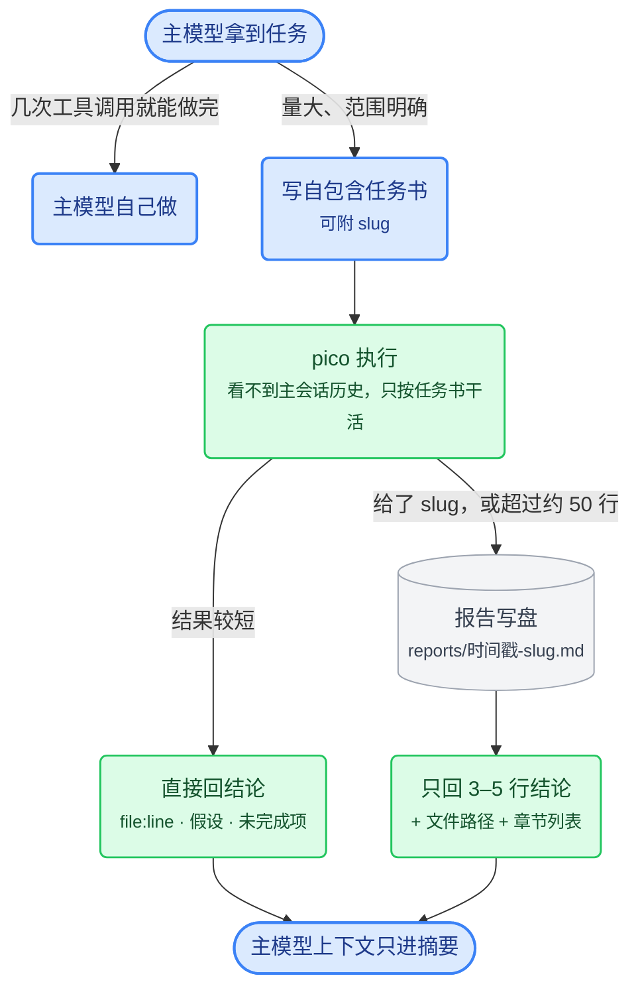

[pi-playbook](../README.md) › [主线](../README.md#文档导航) › **06 pico 子代理**

# 子代理：pico.md

子代理功能来自 [`@tintinweb/pi-subagents`](https://github.com/tintinweb/pi-subagents)，用法和 Claude Code 的子代理类似：用 `Agent` 工具派发，可以前台、后台或并行运行，中途用 `steer_subagent` 纠偏，结束后用 `get_subagent_result` 取结果。插件本身的参数见 [04-高阶阶段.md](04-高阶阶段.md)，本文只讲我写的 pico。

一次委托从头到尾是这样走的：主模型先判断要不要委托，再把任务书交给 pico；结果短就直接回，长就写盘、只回摘要。



自定义代理是一个 Markdown 文件，YAML frontmatter 定义属性，正文是 system prompt：

- 全局：`~/.pi/agent/agents/<name>.md`（本仓库的 [`config/agents/pico.md`](../config/agents/pico.md)）
- 项目：`.pi/agents/<name>.md`（项目级覆盖全局同名）

## pico.md 的 frontmatter

```yaml
---
description: Runs substantial, well-scoped tasks on a cheaper model and returns a concise summary, keeping raw output out of the parent's context. Good fits — repo-wide recon, independent implementation slices of a larger change, test authoring, long test/build runs, multi-source web research. Each call costs a minute or more (cold start, thinking, re-reading files), so the parent handles anything it can finish in a few tool calls itself — lookups, short Q&A, small edits and fixes. Give it a self-contained prompt; it sees nothing else.
display_name: Pico
model: deepseek/deepseek-flash
thinking: high
prompt_mode: replace
inherit_context: false
extensions: [pi-fff, pi-web-access]
skills: true
tools: find, grep, ls, bash, read, edit, write
---
```

| 字段 | 取值 | 含义 |
|------|------|------|
| `description` | 一段英文 | 主模型据此决定要不要委托，见表下说明 |
| `display_name` | `Pico` | 界面上显示的名字 |
| `model` | `deepseek/deepseek-flash` | DeepSeek 的执行档模型；接入和思考档位见 [ref-models.md](ref-models.md)。换模型时，连同 models.json 和 settings.json 的 enabledModels 一起检查 |
| `thinking` | `high` | 思考档位直接影响子代理多久能返回。调研、机械性修改用 high 够了；结果质量明显变差时再调到 max |
| `prompt_mode` | `replace` | 用正文整体替换默认 system prompt（`append` 则是追加在后面） |
| `inherit_context` | `false` | 不继承主会话历史，保持隔离，也省上下文 |
| `extensions` | 两个扩展 | 声明加载 pi-fff（搜索）和 pi-web-access（联网）；实际能用哪些工具，以子代理会话里的加载和激活结果为准 |
| `skills` | `true` | 加载技能 |
| `tools` | 内置工具列表 | 七个基础工具（find/grep/ls/bash/read/edit/write）；扩展工具由 `extensions` 和 `ext:` 选择器控制，嵌套委托由 `allowed_subagents` 控制 |

`description` 显示在 `Agent` 工具的 `subagent_type` 说明里，主模型据此决定要不要委托。它写明两件事：适合交给 pico 的活（仓库级调研、独立实现切片、写测试、长时间测试/构建、多源联网调研），以及每次调用至少一分钟的固定开销，提醒主模型几次工具调用就能做完的事自己做。措辞和 AGENTS.md 的委托规则保持一致。

两个设计要点：

1. **内置工具和扩展工具分开选。** `tools` 列出了子代理插件识别的全部七个内置工具，所以 `Agent` 工具说明里 pico 的工具显示为 `*`。`extensions` 负责加载 pi-fff 和 pi-web-access，需要更细时可以用 `ext:<扩展>/<工具>` 筛选。主会话靠 `override` 用上 FFF 版的 `find` / `grep`；子代理会话里可能还会同时出现 `fffind` / `ffgrep`。联网工具能否用，要在实际的子代理会话里核对。

   权限方面：pico 没写 `allowed_subagents`，插件据此关闭嵌套委托。`bash` 依然能删文件、推代码，正文要求这类操作必须有任务的明确授权——安全性取决于代理是否遵守指令。
2. **模型分工。** 主模型（GPT-6 Astra / GPT-6.1 Sol）负责推理和决策，DeepSeek Flash 负责执行。任务书写清楚，执行档照做即可，主力模型的 token 留给真正需要判断的地方。

## 正文 prompt 的设计

正文（system prompt）分五段，每段解决一个问题：

1. **自包含**：“你能看到的一切都在 prompt 里。”子代理看不到主会话历史，委托方必须写一份自包含的任务书；这一段还告诉子代理，缺信息时什么情况下自己查、什么情况下停下来问。
2. **云盘排除区**：子代理读不到全局 AGENTS.md，所以排除路径在正文里再列一遍。任务碰到这些路径时，报告冲突，交给主会话处理。
3. **执行纪律**：拿到任务直接开工。正文给出 find/grep 和 bash 的选用原则（实际工具名以当前会话暴露的为准），bash 里优先 fd/rg；读文件只读需要的部分，改动尽量小；只做任务范围内的事，范围外的改进写进报告，由主会话决定。
4. **返回格式**：最终消息先给结论，附 file:line，说明做了哪些假设、还剩什么没做。后台完成通知只带预览，主代理用 `get_subagent_result` 读完整结果。
5. **大报告写盘**：委托方在任务书里只给一个 slug，子代理自己取时间戳、拼出路径写盘；没给 slug 但结果超过约 50 行时，自己起一个。文件存到 `~/.pi/agent/reports/<时间戳>-<slug>.md`，最终消息只带 3–5 行结论、文件路径和章节列表。这是整个设计的关键：**大段内容留在磁盘上，主会话上下文只进摘要**，省下主模型的 token。

## 与主会话的配合

pico.md 规定被委托方怎么干活；什么时候委托、什么时候自己做，由全局 AGENTS.md 规定，见 [07-全局指令.md](07-全局指令.md) 的“子代理委托策略”。两份文件要配套修改。

---

← [05 界面与观测](05-界面与观测.md) · [返回目录](../README.md#文档导航) · [07 全局指令](07-全局指令.md) →
