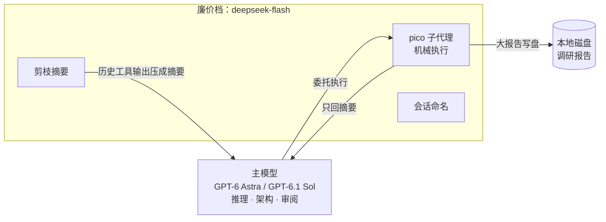
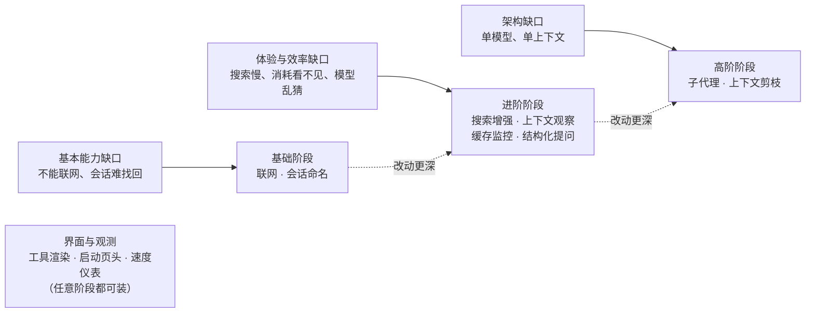
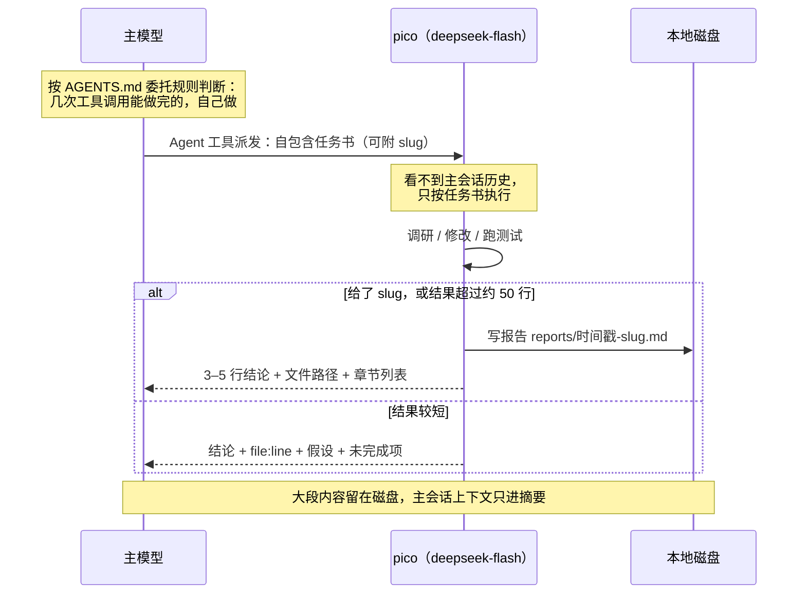
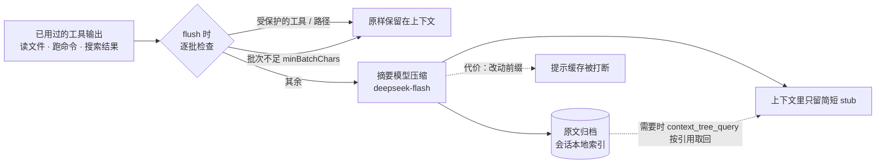

# Mermaid 草图（临时文件，合并前删除）

## 1. README：核心理念

> 贵的模型做决策，便宜的模型做执行；上下文能剪就剪，能写盘就写盘。

```mermaid
flowchart LR
    M["主模型<br/>GPT-6 Astra / GPT-6.1 Sol<br/>推理 · 架构 · 审阅"]

    subgraph cheap["廉价档：deepseek-flash"]
        P["pico 子代理<br/>机械执行"]
        S["剪枝摘要"]
        N["会话命名"]
    end

    D[("本地磁盘<br/>调研报告")]

    M -- "委托执行" --> P
    P -- "大报告写盘" --> D
    P -- "只回摘要" --> M
    S -- "历史工具输出压成摘要" --> M
```

## 2. 01 理念与路线：缺口 → 阶段

```mermaid
flowchart LR
    G1["基本能力缺口<br/>不能联网、会话难找回"] --> S1["基础阶段<br/>联网 · 会话命名"]
    G2["体验与效率缺口<br/>搜索慢、消耗看不见、模型乱猜"] --> S2["进阶阶段<br/>搜索增强 · 上下文观察<br/>缓存监控 · 结构化提问"]
    G3["架构缺口<br/>单模型、单上下文"] --> S3["高阶阶段<br/>子代理 · 上下文剪枝"]

    S1 -. "改动更深" .-> S2 -. "改动更深" .-> S3

    UI["界面与观测<br/>工具渲染 · 启动页头 · 速度仪表<br/>（任意阶段都可装）"]
```

## 3. 06 pico：一次委托的流程

```mermaid
sequenceDiagram
    participant M as 主模型
    participant P as pico（deepseek-flash）
    participant D as 本地磁盘

    Note over M: 按 AGENTS.md 委托规则判断：<br/>几次工具调用能做完的，自己做
    M->>P: Agent 工具派发：自包含任务书（可附 slug）
    Note over P: 看不到主会话历史，<br/>只按任务书执行
    P->>P: 调研 / 修改 / 跑测试
    alt 给了 slug，或结果超过约 50 行
        P->>D: 写报告 reports/时间戳-slug.md
        P-->>M: 3–5 行结论 + 文件路径 + 章节列表
    else 结果较短
        P-->>M: 结论 + file:line + 假设 + 未完成项
    end
    Note over M,D: 大段内容留在磁盘，主会话上下文只进摘要
```

## 4. 04 pi-condense：剪枝怎么处理工具输出

```mermaid
flowchart LR
    A["已用过的工具输出<br/>读文件 · 跑命令 · 搜索结果"] --> F{"flush 时<br/>逐批检查"}

    F -- "受保护的工具 / 路径" --> K["原样保留在上下文"]
    F -- "批次不足 minBatchChars" --> K
    F -- "其余" --> P["摘要模型压缩<br/>deepseek-flash"]

    P --> C["上下文里只留简短 stub"]
    P --> I[("原文归档<br/>会话本地索引")]
    I -. "需要时 context_tree_query 按引用取回" .-> C

    P -. "代价：改动前缀" .-> X["提示缓存被打断"]
```
