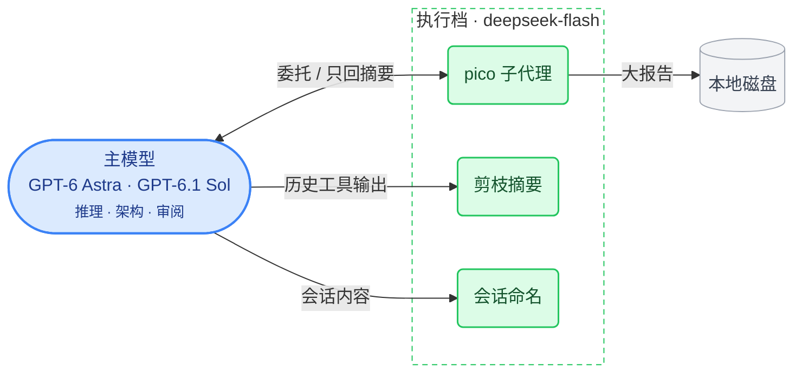
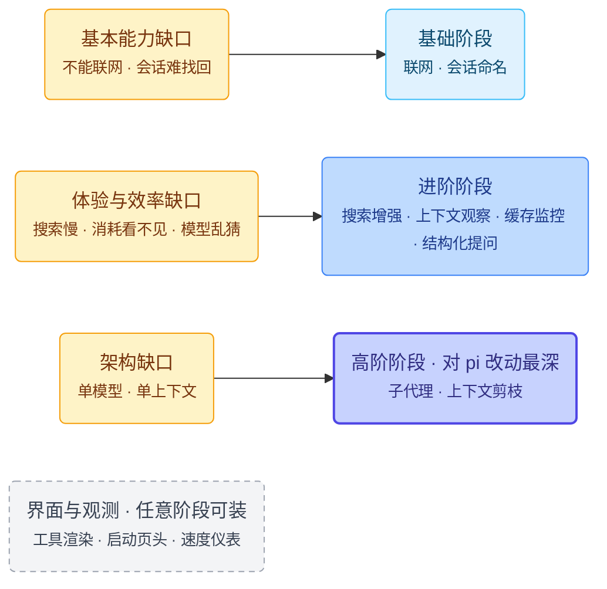
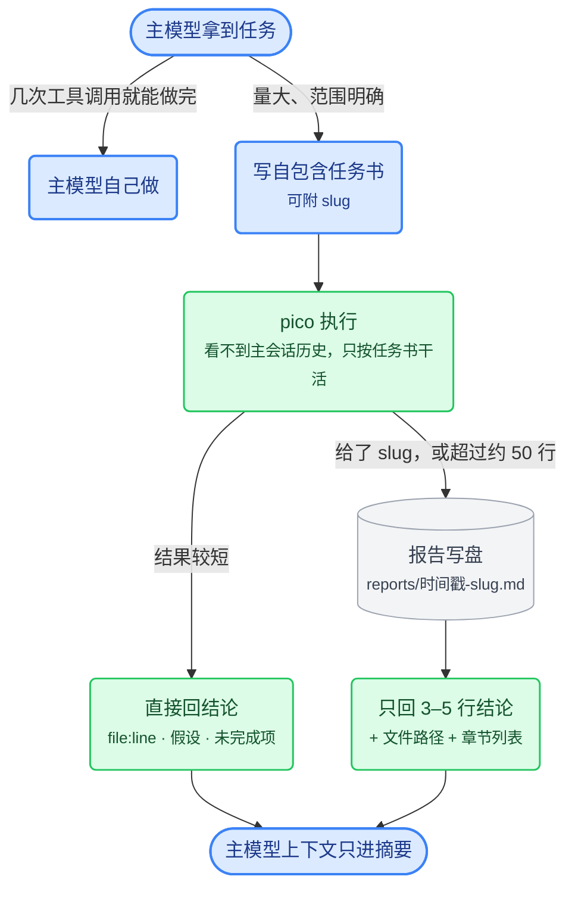
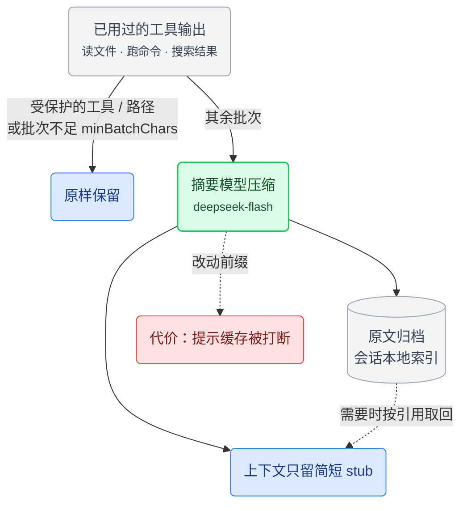
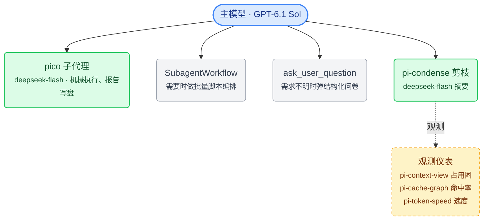

# Mermaid 草图（临时文件，合并前删除）

配色约定：蓝 = 主模型 / 决策，绿 = 廉价档 / 执行，灰 = 存储，琥珀 = 问题，红 = 代价。

## 1. README：核心理念

> 贵的模型做决策，便宜的模型做执行；上下文能剪就剪，能写盘就写盘。

## 2. 01 理念与路线：缺口 → 阶段

## 3. 06 pico：一次委托的流程

## 4. 04 pi-condense：剪枝怎么处理工具输出

## 5. 01 / 04 整体架构（替换原来的字符画）

04 的版本多一个 SubagentWorkflow，01 的版本去掉它。

