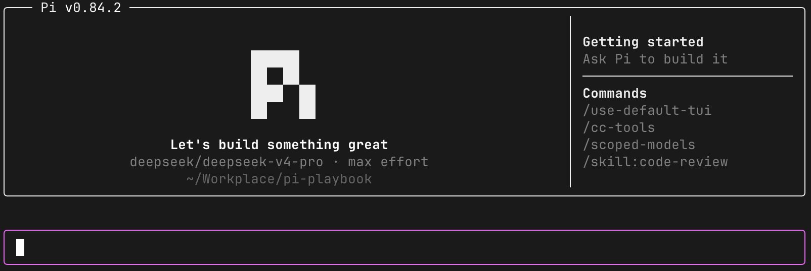

# pi-claude-code-tui（本地定制版）

基于上游 v0.1.13 的本地定制插件。启动时显示 Pi 页头，保留 pi 原生页脚和进度指示器。



截图来自早期会话；页头的 Pi 版本和模型名称随当前运行环境变化。

## 安装

在仓库根目录执行：

```bash
cp -r plugins/pi-claude-code-tui ~/.pi/agent/extensions/
pi
```

首次启动默认应用定制界面；会话内用 `/use-default-tui` 恢复原生界面，用 `/use-claude-code-tui` 再次启用。选择保存在 `~/.pi/agent/pi-claude-code-tui.json`，下次启动继续生效。状态文件写入失败时，本次会话的切换仍生效。

## 界面

- 动画 π 徽标与 Pi 版本页头，徽标和标题最终使用固定灰白色；展示当前模型、思考档位和工作目录。
- 宽终端显示命令提示栏，包含 `/use-default-tui` 和三个随机选出的可用命令。
- 输入框使用完整的圆角边框与 pi 原生反色光标；保留原生页脚与进度指示器，工作提示词轮换显示。

定制项、上游差异和状态文件说明见 [INSTALL.md](./INSTALL.md)。

## 本地开发

```bash
pi -e .
```

## 许可

MIT。见 [LICENSE](./LICENSE)。
